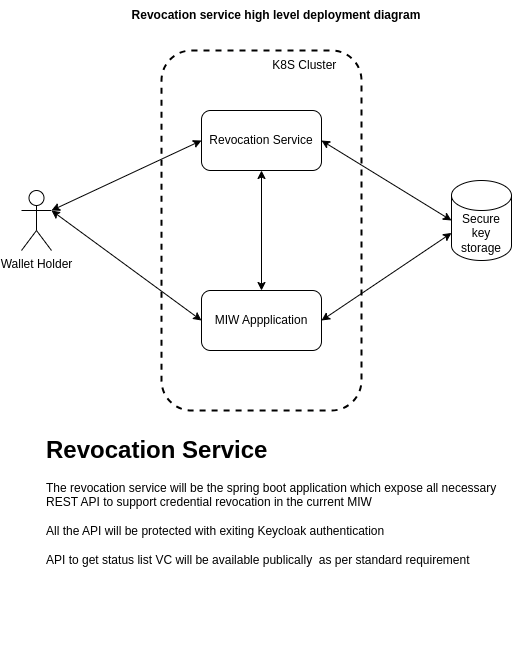
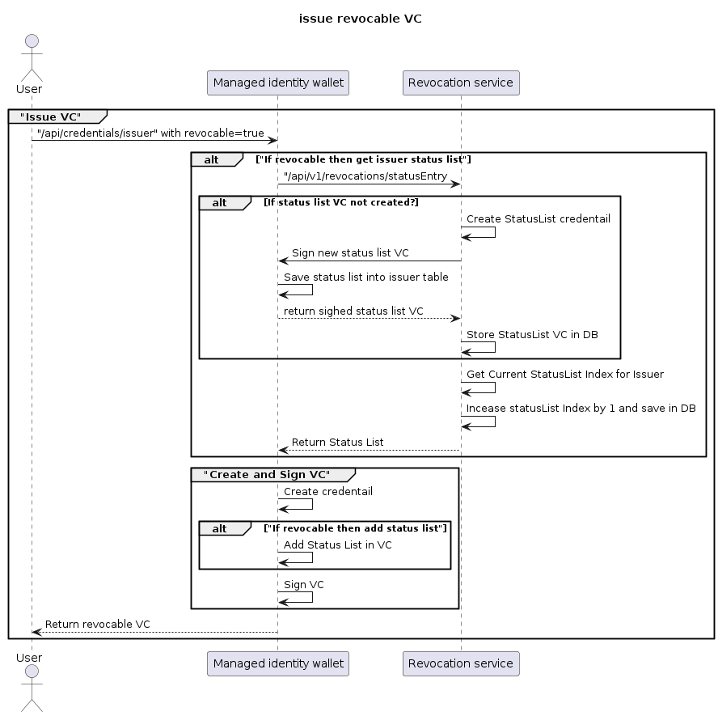
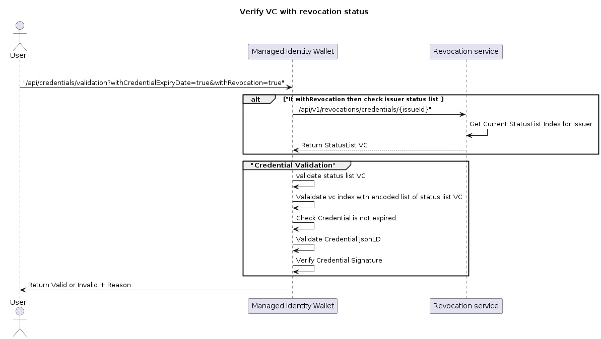

# Table of content

[[toc]]

# Introduction and Goals

We have a Managed Identity Wallet(MIW) application and this application is used to issue various types of verifiable
credentials using did:web method.

As per business needs issuer might want to revoke issued credentials issued to any holder so credential validation will
not work.

Simply deleting credentials will not work as there might be possible that holder save credentials in other location and
present it to verifier.

When any business partner deboarded from Catena-X

When there a any changes in credentials or updates needed in credentials. In this case, we need to revoke the older VC
and need to reissue it.

The core functionalities are:

1. Issue status list credentials to all wallets (Issuer)
2. Maintain status list index for revocation
3. Verify revocation status of credential

## Cross-cutting Concepts

Please refer to this for more information: [Status List 2021](https://www.w3.org/TR/2023/WD-vc-status-list-20230427)

## Requirements Overview

The basic requirements for the Managed Identity Wallet are as follows:

- issue status list to all issuers using REST API

- Manage status list index for each issuer

- Allow issuers to revoke credentials using REST API

- Allow verifier to verify status of credential using REST API

- Update status list credential when issuer revoke credential using REST API

## Quality Goals

1. Status list VC should be stored in durable storage and backup should be taken
2. The current index should be created for each issued revocable VC
3. while revocation, the correct index should be revoked
4. The application should work in case of horizontal scanning
5. Only Authorize user/client can access the revocation API
6. One status list index should be created for one VC
7. Sonar quality gate should be passed
8. No issues in veracode scanning
9. Unit test coverage should be more than 80%

## Stakeholders

The key stakeholders of the component are:

- Issuer: Issuer should be able to issue revocable credentials and able to revoke issued credentials when there a need

- Verifier: Verify status of credential(active/revoked) along with signature and expiry date verification

# Architecture Constraints

The architecture of the Revocation Service follows the general
principles, guidelines and boundaries from the [Tractus-X
project](https://projects.eclipse.org/projects/automotive.tractusx). You can
find more details and documentation on the [Tractus-X GitHub
page](https://github.com/eclipse-tractusx).

# System Scope and Context

- Issuer can issue and revoke credentials
- verifier can verify status of credentials

## Business Context

- Catena-X portal/Base wallet:

    - CX-Operator onboard business partner and that will create a wallet for them

    - CX-Operator can verify the revocation status of any VC issued by the base wallet

    - CX-Operator can revoke issued VC

- Business partner wallet:

    - Any business partner can issue revocable VC to a self-wallet

    - Business partners can verify the status of any VC

    - Business partners can revoke self-issued VC

## Technical Context



# Solution Strategy

The Revocation service is implemented as an independent REST API
service using the following technology stack:

- Java 17 as a base programming language
- SpringBoot as an encompassing framework
- PostgreSQL as a database backend
- Gradle as a build tool
- Dockerized setup for Kubernetes with Helm

# Runtime View

API documentation can be found [openapi_v001.json](..%2F..%2Fapi%2Frevocation-service%2Fopenapi_v001.json)

In general, the API covers the following functionality:

### 1.Get status list entry

In this endpoint, the Issuer will call this endpoint while issuing Revocable VC. The revocation service will create a
status list vc if not created and in return will give a status list entry with an updated index.
BPN number will be the issuer id in our case.


Request Body:

```json
 {
    "purpose": "revocation",
    "issuerId": "BPNL000000000000"
}
```

Response Body:

```json
{
    "id": "https://977d-203-129-213-107.ngrok-free.app/api/v1/revocations/credentials/BPNL000000000000/revocation/1#12",
    "statusPurpose": "revocation",
    "statusListIndex": "12",
    "statusListCredential": "https://977d-203-129-213-107.ngrok-free.app/api/v1/revocations/credentials/BPNL000000000000/revocation/1",
    "type": "StatusList2021"
}

```

### 2. Get the status list VC

In this endpoint, the Verifier will provide issuerId, and the revocation service will provide the StatusList VC of that
issuer.

**_This API should be public_**


Response:

```json
{
    "@context": [
        "https://www.w3.org/2018/credentials/v1",
        "https://w3id.org/vc/status-list/2021/v1",
        "https://w3id.org/security/suites/jws-2020/v1"
    ],
    "id": "http://localhost/api/v1/revocations/credentials/BPNL000000000000/revocation/1",
    "type": [
        "VerifiableCredential",
        "StatusList2021Credential"
    ],
    "issuer": "did:web:localhost:BPNL000000000000",
    "issuanceDate": "2024-02-05T09:39:58Z",
    "credentialSubject": [
        {
            "statusPurpose": "revocation",
            "id": "http://localhost/api/v1/revocations/credentials/BPNL000000000000/revocation/1",
            "type": "StatusList2021",
            "encodedList": "H4sIAAAAAAAA/wMAAAAAAAAAAAA="
        }
    ],
    "proof": {
        "proofPurpose": "assertionMethod",
        "type": "JsonWebSignature2020",
        "verificationMethod": "did:web:localhost:BPNL000000000000#ed463e4c-b900-481a-b5d0-9ae439c434ae",
        "created": "2024-02-05T09:39:58Z",
        "jws": "eyJhbGciOiJFZERTQSJ9..swX1PLJkSlxB6JMmY4a2uUzR-uszlyLrVdNppoYSx4PTV1LzQrDb0afzp_dvTNUWEYDI57a8iPh78BDjqMjSDQ"
    }
}

```

### 3. Revoke VC

In this endpoint, the Issuer will request to revoke VC with StatusList. The revocation service will verify the VC and If
the VC is valid then it will set the bit value in the encoded list and reissue the status list VC to the issuer.


Request:

```json
{
    "id": "https://977d-203-129-213-107.ngrok-free.app/api/v1/revocations/credentials/BPNL000000000000/revocation/1#12",
    "statusPurpose": "revocation",
    "statusListIndex": "12",
    "statusListCredential": "https://977d-203-129-213-107.ngrok-free.app/api/v1/revocations/credentials/BPNL000000000000/revocation/1",
    "type": "StatusList2021"
}
```

Response:

```
Verifiable credential revoked successfully.
```

### 4. Verify credential status

Using this endpoint, verifier can check current status of credential whether certificate is active of revoked


Request:

```json
{
    "id": "https://977d-203-129-213-107.ngrok-free.app/api/v1/revocations/credentials/BPNL000000000000/revocation/1#12",
    "statusPurpose": "revocation",
    "statusListIndex": "12",
    "statusListCredential": "https://977d-203-129-213-107.ngrok-free.app/api/v1/revocations/credentials/BPNL000000000000/revocation/1",
    "type": "StatusList2021"
}
```

Response:

```json
{
    "status": "active"
}
```

In the following, the most relevant operations are described as sequence
diagrams.

### Create Wallet

### Issue revocable credential



```
@startuml
title issue revocable VC
actor User as User
participant "Managed identity wallet" as MIW
participant "Revocation service" as RS
group "Issue VC"
User -> MIW: "/api/credentials/issuer" with revocable=true
alt "If revocable then get issuer status list"
MIW -> RS: "/api/v1/revocations/statusEntry
alt If status list VC not created?
RS -> RS: Create StatusList credentail
RS -> MIW: Sign new status list VC
MIW -> MIW: Save status list into issuer table
RS<-- MIW: return sighed status list VC
RS -> RS: Store StatusList VC in DB
end
RS -> RS: Get Current StatusList Index for Issuer
RS -> RS: Incease statusList Index by 1 and save in DB
RS --> MIW: Return Status List
end
group "Create and Sign VC"
MIW -> MIW: Create credentail
alt "If revocable then add status list"
MIW -> MIW: Add Status List in VC
end
MIW -> MIW: Sign VC
end group
MIW --> User: Return revocable VC
end group
@enduml

```

### Verify revocable credential



```
@startuml
actor User as User
participant "Managed Identity Wallet" as MIW
participant "Revocation service" as RS
title Verify VC with revocation status
group "Verify VC"
User -> MIW: "/api/credentials/validation?withCredentialExpiryDate=true&withRevocation=true"
alt "If withRevocation then check issuer status list"
MIW -> RS: "/api/v1/revocations/credentials/{issueId}"
RS -> RS: Get Current StatusList Index for Issuer
RS --> MIW: Return StatusList VC
end
group "Credential Validation"
MIW -> MIW: validate status list VC
MIW -> MIW: Valaidate vc index with encoded list of status list VC
MIW -> MIW: Check Credential is not expired
MIW -> MIW: Validate Credential JsonLD
MIW -> MIW: Verify Credential Signature
end group
MIW --> User: Return Valid or Invalid + Reason
@enduml
```

# Deployment

A description of the overall structure of components including how to
run and test it locally as well as on Kubernetes in the cloud is
available in the GitHub repository:
<https://github.com/eclipse-tractusx/managed-identity-wallet>

The INT/DEV deployment is done using Helm charts. The charts are located in the
`charts/` sub-directory of the repository. The charts are picked up by
[ArgoCD](https://argo-cd.readthedocs.io/en/stable/) and executed, resulting in
a INT/DEV deployment into the respective Kubernetes cluster. ArgoCD polls the
GitHub status continuously and executes the Helm charts when a new commit is
detected on one of the target branches, e.g. "main". A benefit of ArgoCD is that it
automatically detects variables from the Helm charts and displays them in the
ArgoCD UI.

[ArgoCD INT](https://argo.int.demo.catena-x.net/)
[ArgoCD DEV](https://argo.dev.demo.catena-x.net/)

For local setup, instruction will be added in README.md file

# Guiding Concepts

Please refer: https://www.w3.org/TR/2023/WD-vc-status-list-20230427

# Design Decisions

Revocation service is developed at Cofinity-X and as per discussion with a product owner of MIW cofinity-x has decided to
contribute to the eclipse tractus-x

# Quality Requirements

The work being done on the project has been focused on creating a base
implementation of the Managed Identity Wallet Service. The current state has
compromised on some aspects to further progress the development. The [Risks and
Technical Depts](#technical-debts) section addresses those points in greater
detail. Nevertheless we've focused on Security and Deploy ability.

The Revocation service sticks to the following Quality Gate
requirements where relevant and applicable:

- Documentation: Architecture
- Documentation: Administrator\'s Guide
- Documentation: Interfaces
- Documentation: Source Code
- Documentation: Development Process
- Documentation: Standardization - Interoperability and Data Sovereignty
- Compliance: GDPR
- Test Results: Deployment/Installation
- Test Results: Code Quality Analysis
- Test Results: System Integration Tests
- Security & Compliance: Penetration Tests
- Security & Compliance: Threat Modeling
- Security & Compliance: Static Application Security Testing
- Security & Compliance: Dynamic Application Security Testing
- Security & Compliance: Secret scanning
- Security & Compliance: Software Composition Analysis
- Security & Compliance: Container Scan
- Security & Compliance: Infrastructure as Code

# Technical Debts

## Credential sensation is not supported

- DID document only covers varification method. No service endpoints

## SSI Library

- No validation for JsonWebSignature2020 with RSA key
- No Security valdition only Sercurity Assessment done, no attack vectors are tested

# Glossary

| **Term**                | **Definition**                                                                                                                   |
|-------------------------|----------------------------------------------------------------------------------------------------------------------------------|
| MIW                     | Managed Identity wallet application                                                                                              |
| VC                      | Verifiable Credential                                                                                                            |
| VP                      | Verifiable Presentation                                                                                                          |
| Wallet                  | Virtual placeholder for business partner which holds VCs                                                                         |
| Base wallet             | Wallet for Operating company . CX type of VC will be issued using this wallet                                                    |
| Status list credential  | [https://www.w3.org/TR/vc-status-list/#statuslist2021credential](https://www.w3.org/TR/vc-status-list/#statuslist2021credential) |
| Status list entry       | [https://www.w3.org/TR/vc-status-list/#statuslist2021credential](https://www.w3.org/TR/vc-status-list/#statuslist2021credential) |
| Status list index       | [https://www.w3.org/TR/vc-status-list/#statuslist2021entry](https://www.w3.org/TR/vc-status-list/#statuslist2021entry)           |
| Revocation verification | [https://www.w3.org/TR/vc-status-list/#validate-algorithm](https://www.w3.org/TR/vc-status-list/#validate-algorithm)             |
| Encoded list            | [https://www.w3.org/TR/vc-status-list/#bitstring-encoding](https://www.w3.org/TR/vc-status-list/#bitstring-encoding)             |

# NOTICE

This work is licensed under the [Apache-2.0](https://www.apache.org/licenses/LICENSE-2.0).

- SPDX-License-Identifier: Apache-2.0
- SPDX-FileCopyrightText: 2021,2023 Contributors to the Eclipse Foundation
- Source URL: https://github.com/eclipse-tractusx/managed-identity-wallet
